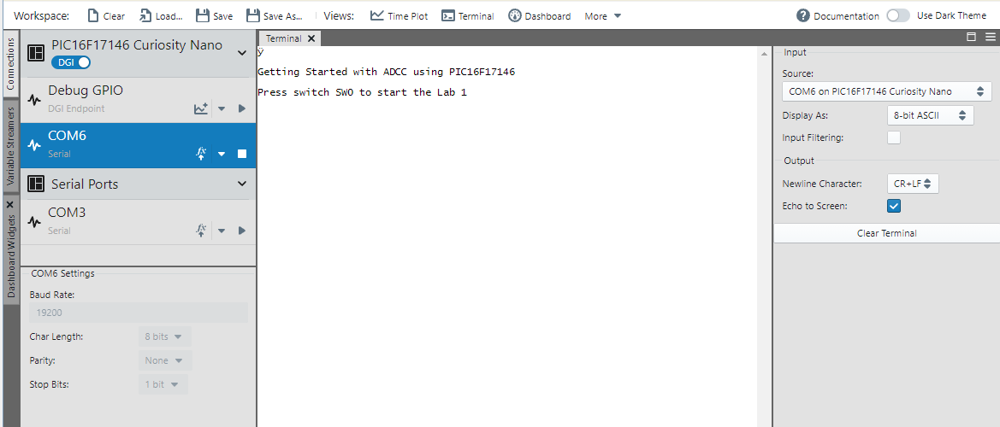
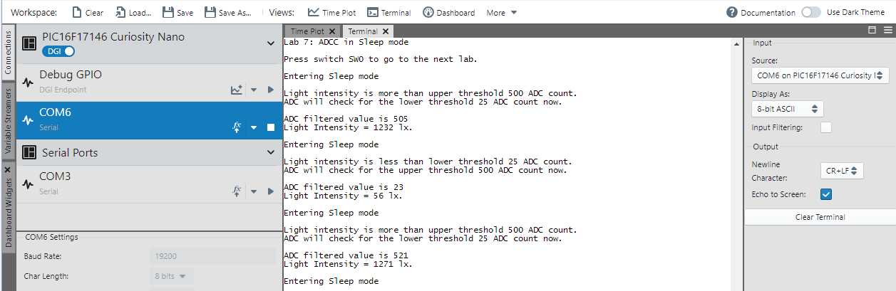
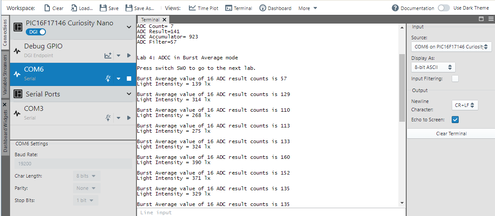
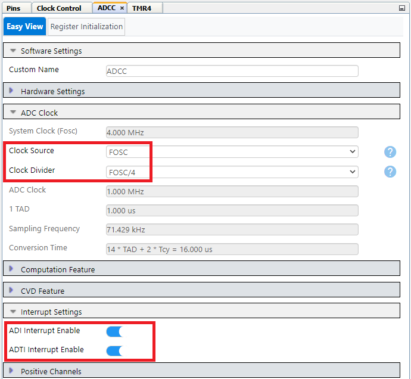
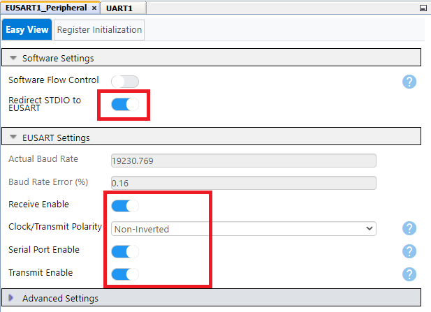

[](https://www.microchip.com)

# Getting Started with ADCC modes on PIC16F17146 Microcontroller

## Introduction

PIC16F17146 and PIC16F18146 family of microcontrollers has a suite of analog peripherals such as 12-bit differential Analog to Digital Converter with computation (ADCC), a low-noise Operational Amplifier (Op-Amp), two 8-bit Digital-to-Analog Converters (DAC), Fixed voltage reference (FVR) that enables precision sensor applications. The 12-bit differential ADCC peripheral is equipped with features such as differential and single-ended measurement, channel grouping, operation in Sleep mode, continuous sampling, and threshold comparison. The ADCC has computation modes such as Accumulate, Average, Burst Average and Low-Pass Filter mode.

## Related Documentation

- [PIC16F17146 Product Page](https://www.microchip.com/product/PIC16F17146)
- [PIC16F17146 Data Sheet](https://www.microchip.com/DS40002343)

## Objective

The following labs are designed for demonstrating various modes and features of the 12-bit ADCC available in PIC16F17146 and PIC16F18146 family of microcontrollers. This MPLAB X project is developed with PIC16F17146 Curiosity Nano board, Curiosity Nano base board and light sensor on the Ambient 7 Click board as shown in block diagram. Each lab contains a brief description of the lab and discussions to make you become easily acquainted with the different features of the ADCC peripheral and ADCC registers of PIC® microcontroller. The output of each lab i.e., ADCC results can be visualized on the terminal window or in graphical format using the MPLAB Data Visualizer plugin of MPLAB X IDE.

- Lab 1: Basic mode
- Lab 2: Accumulate mode
- Lab 3: Average mode
- Lab 4: Burst Average mode
- Lab 5: Low Pass Filter mode
- Lab 6: Differential Mode
- Lab 7: Operation in Sleep mode with Continuous Sampling and Threshold comparison
- Lab 8: Read Internal Temperature Indicator


## Software Used

- MPLAB® X IDE [v6.00 or newer](https://www.microchip.com/mplab/mplab-x-ide)
- XC8 Compiler [v2.35.0 or newer](https://www.microchip.com/mplab/compilers)
- MPLAB® Code Configurator (MCC) [v5.1.2  or newer](https://www.microchip.com/mplab/mplab-code-configurator)
- Microchip PIC16F1xxxx Series Device Support [v1.14.187 or newer](https://packs.download.microchip.com/)

## Hardware Used

- [PIC16F17146 Curiosity Nano](https://www.microchip.com/en-us/development-tool/EV72J15A)
- [Curiosity Nano base board](https://www.microchip.com/development-tool/AC164162)
- [Ambient 7 Click](https://www.mikroe.com/ambient-7-click)

## Setup


PIC16F17146 Curiosity Nano board is used as development platform in this example. Curiosity Nano base board is used for connecting click board to the microcontroller. Ambient 7 click board is placed in mikroBUS slot 1 on the Curiosity Nano base board.  

### Pin Connection Table

|Microcontroller Pin| Signal Description |
|:------------------:|:-----------------:|
| RA2| Light sensor output from Ambient 7 Click board |
| RC0|Switch - SW0 |
| RC1 | LED - LED0 |
| RB7| UART TX|
| RB5 | UART RX |

### Steps to use 5V as VCC on Curiosity Development board

Ambient 7 Click board used in the example requires 5V as VCC for its operation. By default, Curiosity Nano base board provides 3.3V. To use the variable voltage power supply available on a Curiosity Nano board, follow the below mentioned steps:

1.	Remove **R11** and **R15** from Curiosity Nano Base board.
2.	Connect Curiosity Nano board to PC using micro USB cable.
3.	Power the microcontroller using PKOB nano:

  a.	go to MPLAB X **Project** --> **Properties** --> **PKOB nano** -- > **Option categories: Power**

  b.	Check the **Power target circuit** checkbox. Set Voltage Level as **5**.

  c.	Click **Apply**, then **OK**.


### Steps to open Terminal window in Data Visualizer

To see the messages in terminal window, curiosity nano board needs to be connected to terminal emulator. Data Visualizer can be used as terminal emulator. Follow below mentioned procedure to open Terminal Window in Data Visualizer.

Open the Data Visualizer tool which is available as a plugin in MPLAB X IDE.
1.	Click on the **Connections** --> **Serial Ports** tab.
2.	Open COM6 Settings window by clicking on **COM6** tab. Set the Baud Rate to **19200**. Click **Apply**.
*Note: COM port number can be different depending on the availability of port.*
3.	Click on **downward triangle symbol on COM6** tab and select **Send to Terminal** option to start a connection.



### Steps to open Time plot window in Data Visualizer

To visualize the ADCC readings in graphical format, time plot of Data Visualizer is used. Follow below mentioned procedure to open Graph/Time plot in Data Visualizer.

Open the Data Visualizer tool which is available as a plugin in MPLAB X IDE.
1.	Click on the **Connections** --> **Serial Ports tab**.
2.	Open COM6 Settings window by clicking on **COM7** tab. Set the Baud Rate to **19200**. Click **Apply**.

*Note: COM port number can be different depending on the availability of port.*

3.	Click on **right aligned triangle symbol** on COM7 tab.
4.	Click on **Variable Streamer**.
5.  Click on **New Variable Streamer**.
6.	Add new variables as shown in image below and Click on **Save**.
7.  Select **source of the plot** as **COM7** port.
8.	Add plot for **ADCNT** (Uint8), **ADRES**(Uint16), **ADACC**(Uint16), **ADFLTR**(Uint16) and **Light intensity**(Uint16) as shown below for Labs 1 to 5 only. For Lab 6 , add plot for **Channel 1 Single-ended(Ambient light sensor)** (Uint16), **Channel 2 Single-ended(FVR)** (Uint16) and **Differential ADC Result** (Int16).


## Operation

Program the microcontroller with available firmware. Following text message will be printed on the terminal window.


We can progress through each of the labs by pressing the SW0 button on the PIC16F17146 Curiosity Nano board.

Press switch SW0 to execute the lab 1 ADCC in basic mode.

#### Lab 1: Basic single ended Analog-to-Digital Conversion

- This lab demonstrates how to configure ADCC in basic single ended operation.
- Analog voltage corresponding to the ambient light from Ambient 7 Click is read using ADCC in basic mode and the conversion results along with calculated light intensity are updated on time plot.

ADCC result along with calculated light intensity will be updated on the time plot window every 100 ms.


Press switch SW0 to execute the next lab 2 ADCC Accumulate mode.

#### Lab 2: ADCC Accumulate mode

- This lab demonstrates ADCC Accumulate mode.
- 16 ADCC result values are accumulated with Accumulator Right Shift (ADCRS) value of 4.
- Timer2 with period 100 ms is used as auto conversion trigger to ADCC.
- Upon ADCC conversion done interrupt, ADCC conversion count (ADCNT), ADCC Result register (ADRES), ADCC accumulator (ADACC), ADCC filter register (ADFLT) values are sent to the data visualizer using UART.
- When ADCNT = No. of ADCC results to be accumulated the ADCNT and accumulator (ADACC) values are cleared in the FW. At this instance, the filtered value will be equal to the average of no. of ADCC results to be accumulated. Light intensity is calculated by using the filtered value.

ADCC Count, ADCC result, ADCC accumulator value, ADCC filtered value and averaged value of 16 samples corresponding to the ambient light and converted ambient light intensity will be displayed on the time plot window in graphical format every 100 ms.


Press switch SW0 to execute the next lab 3 ADCC Average mode.

#### Lab 3: ADCC Average mode

- This lab demonstrates ADCC Average mode.
- 16 ADCC result values are averaged with ADCC Repeat Count (ADRPT) of 16 and Accumulator Right Shift (ADCRS) value of 4.
- Timer2 with period 100 ms is used as auto conversion trigger to ADCC.
-  Upon ADCC conversion done interrupt, ADCC conversion count (ADCNT), ADCC Result register (ADRES), ADCC accumulator (ADACC), ADCC filter register (ADFLT) values are sent to the data visualizer using UART.
- When ADCNT = ADCC repeat count (ADRPT) the ADCNT, the filtered value will be equal to the average of no. of ADCC results to be accumulated. Light intensity is calculated by using the filtered value.

ADCC Count, ADCC result, ADCC accumulator value, ADCC filtered value and averaged value of ADRPT samples (16) corresponding to the ambient light and converted ambient light intensity will be displayed on the time plot window in graphical format every 100 ms.


Press switch SW0 to execute the next lab 4 ADCC Burst Average mode.

#### Lab 4: ADCC Burst Average mode

- This lab demonstrates ADCC Burst Average mode.
- 16 continuous samples are acquired and averaged at each ADCC trigger with ADCC Repeat Count (ADRPT) of 16 and Accumulator Right Shift (ADCRS) value of 4. Upon ADCC conversion done interrupt, the ADCC filter register (ADFLT) value will be equal to the average of no. of ADCC results. Light intensity is calculated using the filtered value.

*Note: In burst average mode, ADCC Threshold Interrupt  is enabled to generate an interrupt at conversion of 16 samples with each ADCC trigger.*

ADCC filtered value i.e., averaged value of ADRPT (16) continuous samples corresponding to the ambient light and converted ambient light intensity will be displayed on the time plot window in graphical format every 100 ms.


Press switch SW0 to execute the next lab 5 ADCC in LPF mode.

#### Lab 5: ADCC LPF mode

- This lab demonstrates how to configure ADCC in Low Pass Filter mode.
- ADCRS value (1 to 7) determines the -3 dB roll-off frequency of filter. Corresponding Repeat register value, ADRPT is set as 2<sup>CRS</sup>. The ADRPT value is ignored in filtering operation. Initially, averaging process begins by accumulating samples until the ADCC Count register (ADCNT) is equal to the ADRPT register. After this initial averaging, the ADCC module goes to continuous filtering operation.
- The equation for cut off frequency is given below.<br>
  `Frequency @ -3dB    =   Radians @ -3dB / 2πT`

Where T = total sampling time, which is the time required to acquire a single-filtered conversion result. The values of Radians @ 3dB corresponding to each CRS value is tabulated below. In this example, Timer2 is used as auto trigger to start ADCC conversion with period T = 100 ms.

|ADCRS| Radians @ -3 dB |  Cut-off Frequency (Hz) |
|:------------------:|:-----------------:|:-----------------:|
| 1| 0.72 | 1.146|
| 2|0.284 | 0.452|
| 3 | 0.134| 0.213|
| **4**| **0.065**| **0.103**|
| 5 | 0.032 |0.051|
| 6 | 0.016 | 0.025|
| 7 | 0.0078 |0.012 |

ADCC result, ADCC filtered value corresponding to the ambient light and converted ambient light intensity will be updated to the time plot window in graphical format every 100 ms.


Press switch SW0 to execute the next lab 6 ADCC operation in differential mode.

#### Lab 6: Differential Mode

- This lab demonstrates how to configure ADCC in differential mode.
- In differential mode, the ADCC measures the voltage difference between the positive and negative input channels.  
- This lab demonstrates single ended ADC measurement of both ambient light sensor and FVR output voltage. Further, it shows the differential mode measurement between these channels.
- In differential mode, ambient light sensor is connected to positive channel of ADCC.  A constant voltage of 1.024V supplied by FVR is connected to negative channel of ADCC. When ambient light sensor output is more than FVR output , ADC result is in positive range. When ambient sensor output is less than FVR output, ADC result is in negative range.
- To operate ADC in differential mode, set the ADC Input Configuration (IC) bit of ADCON0 to 1

Single-ended ADC result corresponding to ambient light sensor (Channel 1), FVR (Channel 2) and differential ADC Result will be updated to the time plot window in graphical format every 100 ms.


Press switch SW0 to execute the next lab 7 ADCC operation in sleep mode

#### Lab 7: ADCC operation in Sleep mode using Continuous sampling and Threshold comparison

- This lab shows the operation of ADCC in microcontroller sleep mode with ADCC continuous sampling and threshold comparison feature.
- Enabling sleep mode text will be displayed on the terminal window before microcontroller goes to sleep mode. LED0 will be turned OFF when microcontroller is in sleep mode and turned ON when microcontroller wakes up from the sleep mode upon ADCC threshold interrupt.
- If ADCC results are more than lower threshold and less than upper threshold ADCC will continue working in sleep mode and will not display any result on terminal window.
- Put your finger over the light sensor on the click board to create low ambient light scenario. Lower threshold will be reached, microcontroller will wake up and display the light intensity with warning that the light intensity is below lower threshold of 25 ADC count. Afterwards ADCC will check for the upper threshold 500 ADC count and CPU will go to sleep mode again. ADCC will continue working in sleep mode.
- Flash the light over the light sensor on the click board to increase ambient light. Upper threshold will be reached, microcontroller will wake up and display the light intensity with warning that the light intensity is above upper threshold of 500 ADC count. Afterwards ADCC will check for the lower threshold 25 ADC count and CPU will go to sleep mode again. ADCC will continue working in sleep mode.



Press switch SW0 to execute the next lab 8 ADCC read internal temperature indicator.

#### Lab 8: ADCC Read Internal Temperature Indicator

This lab demonstrates how to configure the ADCC to read the internal temperature indicator and provide device operating temperature value in degree Celsius and Fahrenheit.


Press switch SW0 to restart the execution from lab 1.

### Terminal View of the results

For first 6 labs, results can be observed in terminal view by commenting the corresponding #defines in adcc_*mode_name*_mode.c files.
```
#define GRAPH_BASIC
#define GRAPH_ACCUMULATE
#define GRAPH_AVERAGE
#define GRAPH_BURST
#define GRAPH_DIFFERENTIAL
#define GRAPH_LPF
```
#### Lab 1: Basic single ended Analog-to-Digital Conversion Terminal View:

ADCC result along with calculated light intensity will be printed on the terminal window every second.


#### Lab 2: ADCC Accumulate mode Terminal View:

ADCC Count, ADCC result, ADCC accumulator value, ADCC filtered value will be printed on the terminal window every second. After 16 results the averaged value of 16 samples and converted ambient light intensity will be printed on the terminal window.


#### Lab 3: ADCC Average mode Terminal View:
ADCC Count, ADCC result, ADCC accumulator value, ADCC filtered value will be printed on the terminal window every second. After ADRPT (16) results the averaged value of ADRPT samples (16) and converted ambient light intensity will be printed on the terminal window.


#### Lab 4: ADCC Burst Average mode Terminal View:
ADCC filtered value and the averaged value of ADRPT (16) continuous samples and converted ambient light intensity will be printed on the terminal window every second.



#### Lab 5: ADCC LPF mode Terminal View:
ADCC result, ADCC filtered value and the converted ambient light intensity will be printed on the terminal window every one second.


#### Lab 6: ADCC Differential mode Terminal View:
ADCC result in single-ended measurement of Channel 1 (ambient light sensor), Channel 2 (FVR output) and differential mode measurement will be printed on the terminal window every one second.


## Peripheral Configuration

This section explains how to configure the peripherals using MPLAB X IDE with MCC plugin for recreation of the project.

Refer [Software Used](https://github.com/microchip-pic-avr-examples/pic16f17146-adcc-getting-started-mplab-mcc#software-used) section to install required tools to recreate the project.

Additional Links: [MCC Melody Technical Reference](https://onlinedocs.microchip.com/v2/keyword-lookup?keyword=MCC.MELODY.INTRODUCTION&version=latest&redirect=true)

##### Peripheral Configuration Summary
| Peripherals               | Configuration                                                                                                                                                                                                                                                                                                                                                                                                  | Usage                                                                         |
|---------------------------|----------------------------------------------------------------------------------------------------------------------------------------------------------------------------------------------------------------------------------------------------------------------------------------------------------------------------------------------------------------------------------------------------------------|-------------------------------------------------------------------------------|
|    Clock Control    |    Clock Control:<br>Clock source –   HFINTOSC<br>HF Internal Clock – 4MHz<br>Clock Divider   – 1                                                                                                                                                                                                                                                                                                         |    4 MHz System  clock                                                                     |
|    TMR2               |    Enable Timer<br>Control Mode – Roll over pulse<br>Start/Reset Option – Software Control<br>Clock Source - LFINTOSC<br>Polarity – Rising edge<br>Prescaler – 1:128<br>Postscaler – 1:1<br>Time Period – 1s<br>                                                                                                                                                                  |    Used to auto-trigger ADCC                                           |
|    TMR4               |    Enable Timer<br>Control Mode – Monostable<br>External Reset Source – T4INPPS pin <br>Start/Reset Option – Starts on rising edge on TMR4_ers <br>Clock Source – LFINTOSC<br>Polarity – Rising edge<br>Prescaler – 1:16<br>Postscaler – 1:1<br>Time Period – 0.1s<br>  Timer Interrupt Enabled                                                                                                                                                                |    Used in monostable mode to automate switch debouncing                |     
|    ADCC               |    Input Configuration – Single-ended mode<br>Operating mode – Basic mode<br>Result alignment – Right justified<br>Positive reference – Vdd<br>Auto-conversion trigger – disabled <br>Clock source – Fosc<br>Clock divider – Fosc/4<br>ADI Interrupt Enable – Enabled<br> ADTI Interrupt Enable – Enabled  <br>                     |   Used for measuring light intensity of Ambient 7 sensor <br>   <br>  |
|    FVR                |    FVR Enabled<br>FVR_buffer 1 Gain   – 2x  <br> Enabled Temperature sensor     <br> Voltage Range Selection – Hi_range                                                                                                                                                                                                                                                                                                                                                                |    Positive   reference voltage to ADCC |                                                                                                                                                                                                                                                                                                                                                                                           
|    UART                 | UART1 Driver <br><br> Requested Baudrate – 19200 <br> UART PLIB Selector – EUSART1<br>      <br>EUSART1 PLIB<br><br> Redirect STDIO to EUSART     <br>Enable Receive<br> Enable Transmit<br>  Enable Serial Port                                                                                                                                                                                                     |    Send data to PC terminal   |

##### Peripheral Configuration using MCC

###### Clock Control


###### ADCC




*Note: This ADCC configuration is applicable for ADCC basic mode. For other modes, ADCC configuration is different which is configured in respective labs.*

###### FVR


###### TMR2


###### TMR4


###### UART1 Driver


###### EUSART1 PLIB



###### Pin Grid View


###### Pins


## Summary

The labs in this code example demonstrates various computation modes such as accumulate, average, burst average and low pass filtering of the 12-bit ADCC available in PIC16F17146 and PIC16F18146 family of microcontrollers. The features of ADCC such as single-ended and differential mode, operation in sleep mode, threshold comparison and reading the on-board temperature sensor is also discussed in this example.
